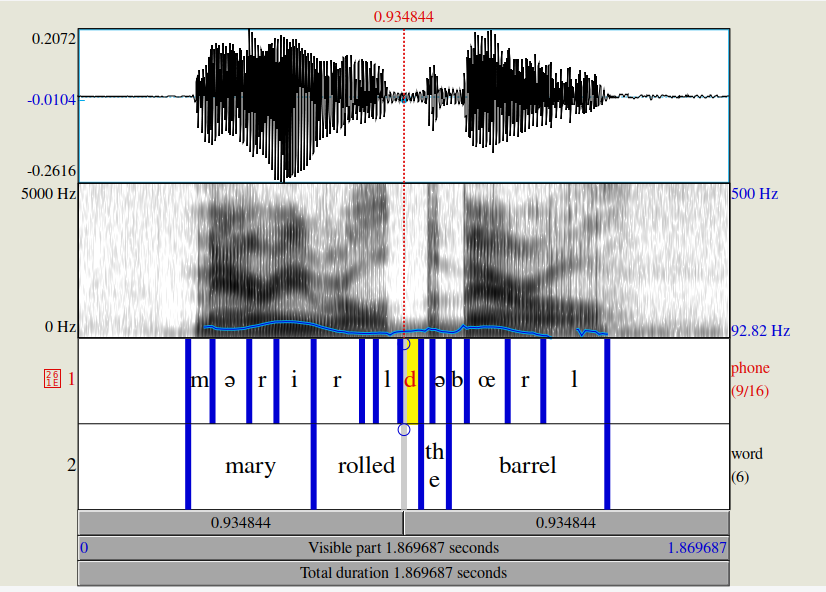

# Trabalho processamento de sinais biológicos - ISD - Aline & André

Neste trabalho fazemos o processamento de sinais de EEG com 32 canais coletado com o software Brain Vision. O protocolo de aquisição apresenta dois estimulos auditivos, base (bá) e desviante (dá), e o participante deveria contar quantas vezes aparecia o estimulo desviante. É esperado que nos canais do EEG onde temos no tempo apresentado o estimulo desviante, temos um maior potencial evocado!

A coleta no software brain vision gera multiplos arquivos, e foi feita com uma frequência de amostragem de 25000 Hz, o que acabou gerando arquivos muito grandes. Cada aquisição com uma média de 6 minutos gerou arquivos em torno de 2.5 GB. Abaixo um exemplo da lista de arquivos e suas extensões gerado pelo software:

```sh
'Aryelli Araujo PEAC L2 ativo.eeg'
'Aryelli Araujo PEAC L2 ativo.ehst2'
'Aryelli Araujo PEAC L2 ativo.hfinf2'
'Aryelli Araujo PEAC L2 ativo.vhdr'
'Aryelli Araujo PEAC L2 ativo.vmrk'
```

Para reduzir o tempo de processamento, optou-se por reduzir a frequência de amostragem para o valor de 1000 Hz. Isso significa que teremos uma redução de 25 pontos para 1 ponto a cada 1 milisegundo.

Nos arquivos originais tem salvo também o resultado de alguns canais que não estão sendo considerados, e para a analise serão descartados. O canal de número 5 também será descartado por ser o eletrodo de referência na toca de EEG. O arquivo "eeg_channels.csv" tem a posição correspondente entre o número de cada canal e a posição no sistema de montagem de EEG 10/10.

## Rodar o Pré-processamento dos arquivos originais

Para fazer esse pré processamento nos dados criou-se o script "process_bv_data.py", que usa o pacote de python MNE, para ler os arquivos gerados pelo Brain Vision, fazer o resample na frequência de 1 KHz, e o drop dos canais que não estão sendo usados. O resultado do script são dois arquivos contendo os sinais do EEG com frequência de aquisição de 1 KHz. Um na extensão .csv e outro na extensão .fif(formato que pode ser lido pelo pacote MNE também). É gerado um arquivo .csv também resultado da conversão do arquivo de anotação do tempo dos disparos dos estimulos (extensão .vrmk).

Para executar o script é só rodar o seguinte comando na pasta do repositório:

```sh
python process_bv_data.py
```
As variáveis que precisam ser alteradas para rodar para os diferentes participantes são:

```python
participant = 'Leila Santos' #Nome do participante, e também o nome do diretório onde estão os dados desse participante

mne_eeg_file = "Leila Santos PEAC L ativo.vhdr" # arquivo principal na hora de fazer a leitura com o pacote MNE
mne_eeg_resampled_file = "Leila Santos PEAC L ativo.fif" # arquivo gerado com MNE e frequência de 1KHz
csv_eeg_resampled_file = "Leila Santos PEAC L ativo.csv" # arquivo gerado CSV com frequência de 1KHz
mne_anot_file = "Leila Santos PEAC L ativo.vmrk" # arquivo de anotação dos estimulos
```

## Rodar o Pré-processamento do audio de estimulo

Nos arquivos do Brain vision para cada participante, tem também um canal que representa o audio do estimulo sonoro que o participante recebeu. O sinal de audio original foi gravado também com uma frequência de amostragem de 25000 Hz. Inicialmente estavamos sem a ordem no tempo de como os estimulos bases e desviantes foram apresentados, tendo somente as marcações de tempo do disparo do estimulo.

Foi criado um script para fazer processamento do audio, e de acordo com as marcações de tempo, foram criados segmentos do audio e foi feita a transcrição de qual a sílaba apresentada em cada estimulo, "bá" ou "dá". Foi necessário fazer essa transcrição para poder segmentar os sinais dos canais adquiridos com o EEG, e conseguir fazer as análises para os dois grupos de estimulos diferentes.

O script criado para processar os sinais de audio é o "process_bv_audio.py". Para executar o script é só rodar o seguinte comando na pasta do repositório:

```sh
python process_bv_audio.py
```

Primeiramente o script vai isolar o canal de audio dos arquivos originais gerados pelo Brain Vision e vai fazer um resample desse audio mudando a frequência de amostragem de 25000 Hz para 16000 Hz. Em seguida foi salvo um arquivo .wav original, com o audio na nova frequência de amostragem, e criado vários arquivos .wav com os diferentes seguimentos que representam os estimulos, apartir de 100 ms antes do estimulo ser apresentado.
Os primeiros seguimentos de todos os audios são descartados pois representam um periodo de inicio da coleta onde ainda não foi apresentado nenhum estimulo ao participante. Todos os outros segmentos que representam estimulos foram processados por um modelo Speech-to-Text para transcrição da silaba apresentada. O modelo STT utilizado foi o "[jonatasgrosman/wav2vec2-large-xlsr-53-portuguese](https://huggingface.co/jonatasgrosman/wav2vec2-large-xlsr-53-portuguese)" disponível através do Hugging Face.
A inferência feita pelo modelo de transcrição é salvo em um csv juntamente com o tempo de marcação de cada estimulo com um deslocamento de 100 ms a menos no tempo do disparo do estimulo. Para a verificação da transcrição foi criado o arquivo .TextGrid que junto com o arquivo .wav fornece uma visualização no tempo do sinal de audio junto com as marcações do estimulo e o texto do estimulo, demonstrando se pertence ao grupo base ou desviante.

A imagem a seguir foi gerada com o software [Praat](https://www.fon.hum.uva.nl/praat/):



As variáveis que precisam ser alteradas para rodar para os diferentes participantes são:

```python
participant = 'Isabelle Vasconcelos' #Nome do participante, e também o nome do diretório onde estão os dados desse participante
mne_eeg_file = "isabelle Vasconceles PEAC R ativo.vhdr" # arquivo principal na hora de fazer a leitura com o pacote MNE
mne_anot_file = "isabelle Vasconceles PEAC R ativo.vmrk"# arquivo de anotação dos estimulos
audio_wav_file = "isabelle Vasconceles PEAC R ativo.wav" # arquivo gerado .wav com frequência de 16KHz
audio_seg_wav_file = "wav/isabelle Vasconceles PEAC R ativo_segm{}.wav" # nome dos arquivos .wav segmentados para inferência de transcrição
segm_csv_file = "isabelle Vasconceles PEAC R ativo audio wav segments.csv" # arquivo CSV com os segmentos de tempo e o tipo de estimulos
audio_textgrid_file = "isabelle Vasconceles PEAC R ativo.TextGrid" # arquivo Text Grid para ser usado junto com o arquivo .wav no software Praat
```
# Notebooks jupyter

## FFR - Frequency Following Response

## Deploy

- Send code to Databricks using Buddy C.I
- Run a job with the following code:


```py
import mlflow

experiment_id = 2485231460527308
PATH = '/dbfs/template/v232/'


params = {
  "metadata": "substantive",
  "limit": "10000",
  "experiment_id": experiment_id,
}
mlflow.run(PATH, backend="local", parameters=params, experiment_id=experiment_id)
```
